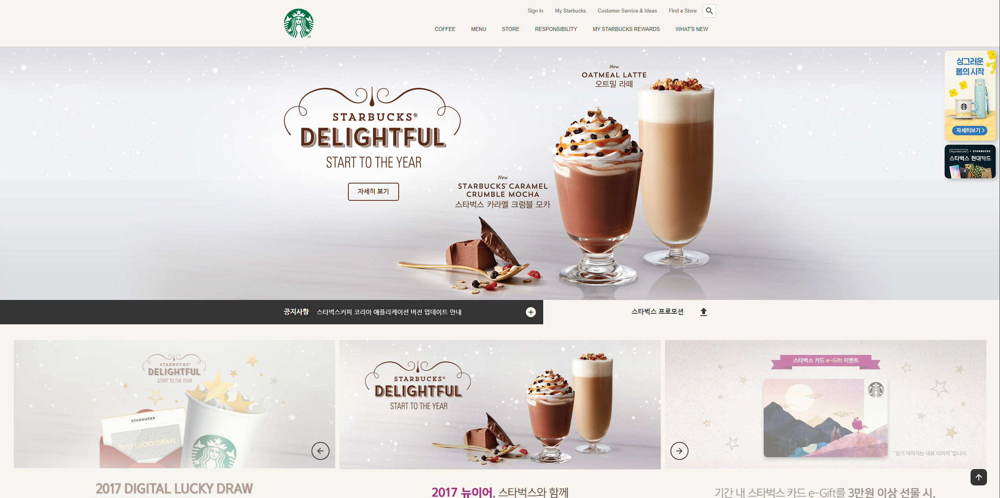
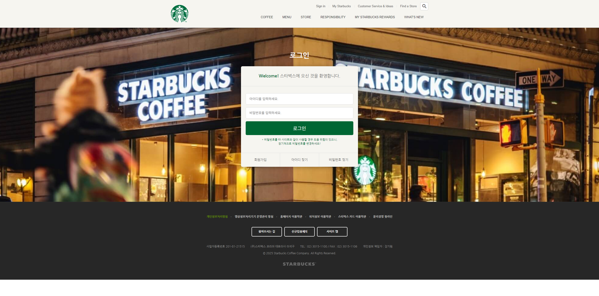

## 📸 프로젝트 미리보기

## 🔗 배포 링크
👉 [https://curious-palmier-1dd079.netlify.app](https://curious-palmier-1dd079.netlify.app)

## 🔧 사용한 스택
- HTML / CSS / JavaScript
- Netlify (배포)

## ✨ 프로젝트 설명
> 이 프로젝트는 **Swiper, GSAP, LODASH, SCROLLMAGIC**을 기반으로 제작되었으며, 주요 기능은 다음과 같습니다.
- Swiper  
  - `.notice-line` `.promotion`, `.award` 섹션 **슬라이드** 구현
- GSAP
  - `.badges`, `#to-top` 스크롤 이벤트 사용하여 **요소 보여짐 및 위치 애니메이션** 구현(`#to-top` 클릭 이벤트 스크롤은 window scrollTo 함수 사용)
  - `.visual` 섹션 내에 커피 및 디저트 요소 **Fade 이벤트** 구현
  - `youtube` 섹션 내에 이미지 요소 **둥둥 떠다니는 애니메이션** 구현
- LODASH
  - `.badges`, `#to-top` 요소 **스크롤 이벤트 최적화**를 위해 `throttle()` 함수 사용  
  (그냥 window scroll 함수로 처리 시, 스크롤 할 때마다 함수 내 이벤트가 처리 되어 과부하 생김)
- SCROLLMAGIC
  - `season-product`, `reserve-coffee`, `pick-your-favorite`, `find-store` 섹션 스크롤 시, 뷰포트 상단 기준 80%에 걸리면 트리거 이벤트 처리
